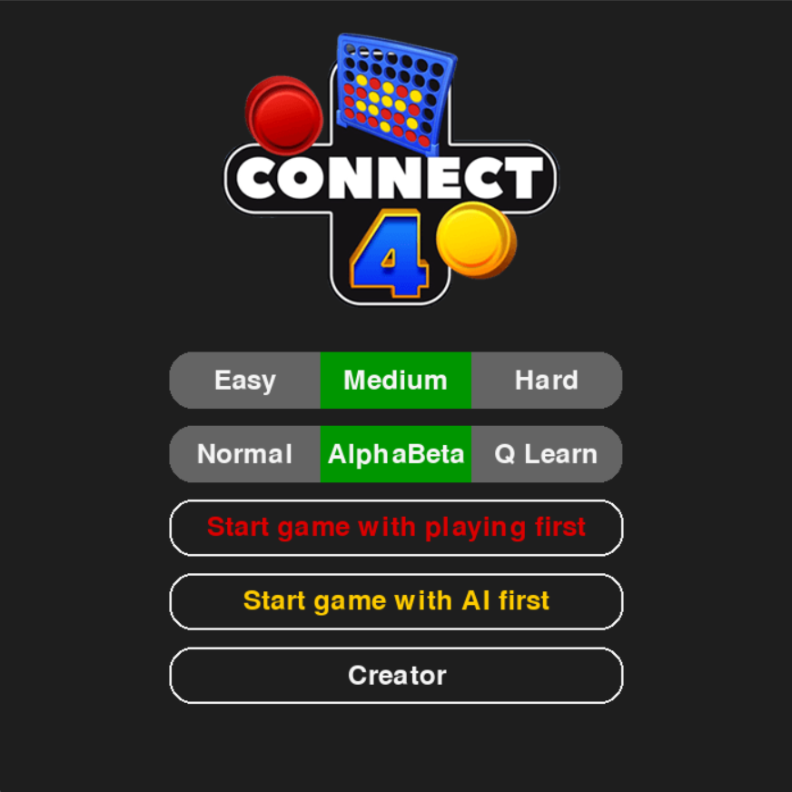
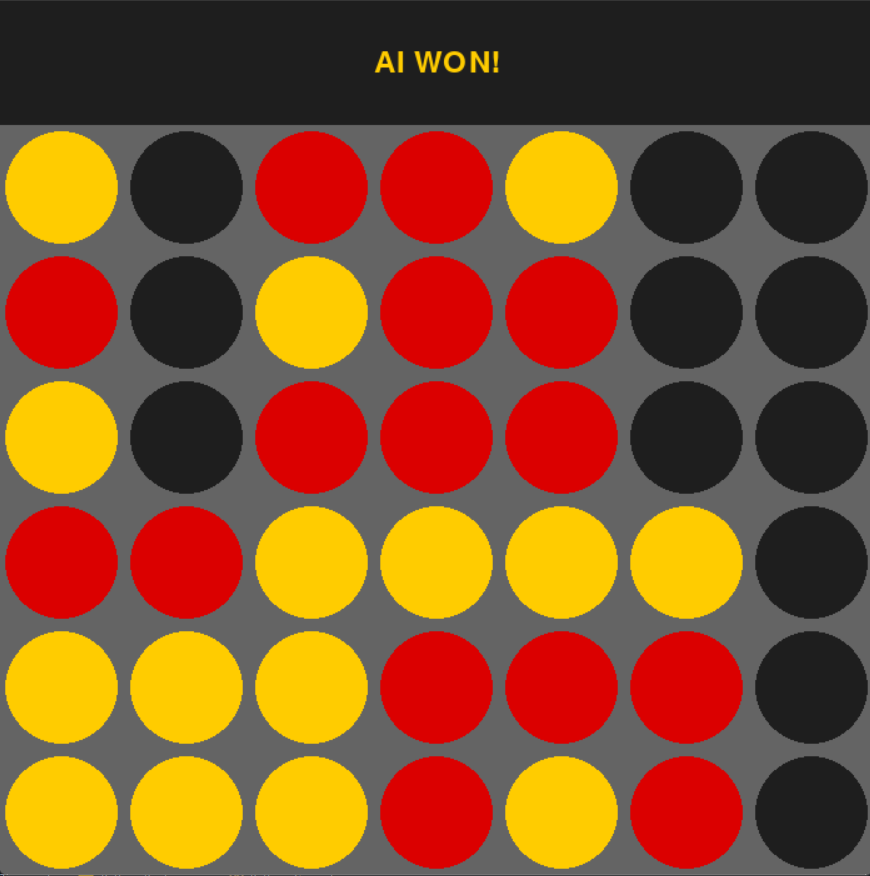

# Connect-4 AI Agent

Artificial Intelligence Final Project For Spring 2023 Course (Instructor: [Dr. Monireh Abdoos](https://scholar.google.com/citations?user=SxxCUagAAAAJ&hl=en)).

In This Project, I tried to implement a Connect-4 AI agent using Multiple Versions of Minimax and Q learning methods.

You can download the report pdf from [here](report.pdf).

## Menu

## Game board

## Implemented Algorithms
- Normal Minimax
- Normal Minimax with Transposition Table optimization (Dynamic Programming)
- Minimax with Alpha Beta Pruning
- Q Learning using the Q-table approach

## Features
- [x] 3 Different Levels For each Algorithm
- [ ] Showing pop-up window with progress bar while Q-Learning agent is getting trained
